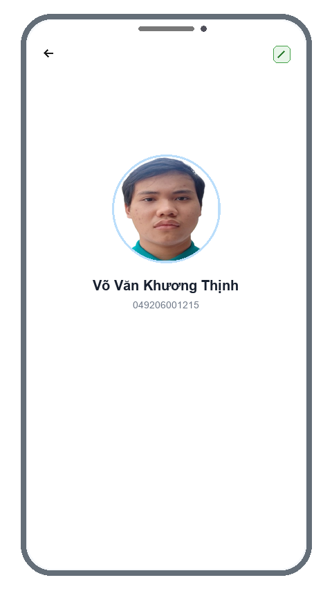

# TÀI LIỆU BÁO CÁO BÀI TẬP TUẦN 1

- **Họ tên:** Võ Văn Khương Thịnh
- **MSSV:** 049206001215
- **Mã lớp:** [012012103402] - Lập trình thiết bị di động - CNS_CS1
- **File báo cáo Word đính kèm:** [`049206001215_VoVanKhuongThinh_BaiTapTuan1.docx`](049206001215_VoVanKhuongThinh_BaiTapTuan1.docx)

---

## 1. MÔ TẢ NGẮN GỌN BÀI TẬP & MỤC TIÊU ĐẠT ĐƯỢC

- **Nhiệm vụ:**
  1. Viết ứng dụng Profile cá nhân bằng Flutter theo mẫu ở Slide 52 và đẩy lên GitHub.
  2. Trả lời các câu hỏi về định hướng nghề nghiệp, nhận định ngành mobile và tác động của AI trong giáo dục (Slide 52 & 53).
- **Mục tiêu:**
  - Nắm chắc cách dùng Flutter dựng giao diện, quản lý state và xử lý tương tác cơ bản (Dialog, BottomSheet).
  - Hoàn thành bài tập đúng hạn và đúng quy cách tổ chức thư mục của Thầy.

---

## 2. KẾT QUẢ ĐẠT ĐƯỢC & HÌNH ẢNH ĐẦU RA (OUTPUT)

App chạy tốt trên cả Windows và Web, giao diện khớp với slide bài giảng.

  
   
  <em>Giao diện ứng dụng Profile Sinh Viên (Võ Văn Khương Thịnh - 049206001215)</em>

---

## 3. GIẢI THÍCH CÁC HÀM VÀ WIDGET CHÍNH (`SourceCode/lib/main.dart`)

- **`StudentProfileApp`**: Widget gốc khởi tạo app với theme Material 3.
- **`ProfileScreen` & `_ProfileScreenState`**: Quản lý thông tin họ tên và MSSV.
- **`_showEditDialog()`**: Hộp thoại chỉnh sửa thông tin sinh viên khi nhấn nút Edit, dùng `setState()` để cập nhật UI ngay lập tức.
- **`_showExtraInfoSheet()`**: BottomSheet hiển thị thông tin lớp, email khi chạm vào avatar hoặc nút chi tiết.
- **`_buildDetailRow()`**: Hàm tiện ích tạo nhanh từng dòng thông tin (icon, nhãn, nội dung).
- **`ClipOval` & `Image.asset`**: Cắt ảnh chân dung thành hình tròn, có xử lý fallback khi lỗi ảnh.

---

## 4. NỘI DUNG TRẢ LỜI CÂU HỎI LÝ THUYẾT (SLIDE 52 & SLIDE 53)

### 4.1. Định hướng cá nhân sau môn học (Slide 52 - Câu 1)
- Em muốn theo đuổi hướng **Fullstack Developer**. Việc học vững Flutter giúp em làm chủ được cả mảng Mobile Client, kết hợp với Backend để tự phát triển các sản phẩm hoàn chỉnh từ A - Z.
- Mục tiêu trước mắt là làm tốt đồ án môn học và có project thực tế để đưa vào CV ứng tuyển thực tập.

### 4.2. Lập trình di động trong 10 năm tới có phát triển không? (Slide 52 - Câu 2)
Em khẳng định là **tiếp tục phát triển rất mạnh**, vì:
1. **Smartphone là trung tâm cuộc sống số:** Mọi tiện ích từ ngân hàng số, định danh điện tử, thẻ xe, liên lạc đều gắn liền với điện thoại.
2. **On-device AI:** Chip điện thoại ngày càng mạnh, chạy được AI trực tiếp trên máy (không cần qua server), giúp app xử lý tức thì và bảo vệ quyền riêng tư người dùng tốt hơn.
3. **Điều khiển hệ sinh thái IoT:** Điện thoại là đầu mối điều khiển nhà thông minh, thiết bị đeo và các phương tiện thông minh.

### 4.3. Mô hình giáo dục HAA (Horowitz Andreessen Academy) (Slide 53 - Câu 1)
- **Triết lý:** Bắt nguồn từ quỹ a16z:
  > *"Internet → Infinite knowledge. AI → Infinite doing. Education must evolve from knowing to doing."*  
  Internet đem lại nguồn tri thức vô tận, còn AI mang lại năng lực thực thi vô tận. Vì thế giáo dục hiện nay không thể chỉ là học thuộc lòng kiến thức (knowing), mà phải là bắt tay vào làm sản phẩm thực tế (doing).
- **Ưu điểm:** Học qua thực chiến (Learn by building), bám sát thị trường, dùng AI làm đòn bẩy tăng năng suất.
- **Nhược điểm:** Dễ bị hổng kiến thức nền tảng (giải thuật, hệ điều hành) nếu quá lạm dụng code AI sinh sẵn; dễ ngộ nhận trình độ của bản thân.

### 4.4. So sánh tiếp cận tri thức qua 3 thời kỳ (Slide 53 - Câu 2)

| Tiêu chí | Trước khi có Internet | Thời kỳ Internet phổ biến | Kỷ nguyên AI hiện nay |
| :--- | :--- | :--- | :--- |
| **Tìm kiếm** | Tốn công: Tìm sách thư viện, hỏi thầy cô. | Dễ dàng: Tìm bằng từ khóa trên Google, Stack Overflow. | Trực tiếp: Hỏi đáp bằng ngôn ngữ tự nhiên, AI trả lời đúng bối cảnh. |
| **Ghi nhớ** | Não bộ phải nhớ từng công thức, cú pháp. | Nhớ từ khóa tìm kiếm và nơi lưu tài liệu. | Não bộ giải phóng việc nhớ cú pháp, tập trung nhớ nguyên lý cốt lõi. |
| **Vận dụng** | Viết code thủ công, sửa lỗi rất lâu. | Copy-paste code mẫu rồi tự sửa lại. | Ra lệnh cho AI tạo khung, người lập trình kiểm tra, sửa lỗi và tối ưu. |

### 4.5. Cần học gì khi AI làm gần như mọi thứ? (Slide 53 - Câu 3)
1. **Thiết kế kiến trúc hệ thống (System Design):** Ghép nối các phần mềm sao cho an toàn, dễ bảo trì và chịu tải tốt.
2. **Năng lực thẩm định code (Verification):** Biết đọc hiểu và phát hiện lỗi ngầm trong code AI sinh ra.
3. **Kỹ năng AI Engineering:** Biết cách prompt chuẩn và tích hợp API mô hình AI vào ứng dụng.
4. **Tư duy sản phẩm (Product Mindset):** Hiểu người dùng cần gì để làm ra tính năng thực sự có ích.

### 4.6. Năng lực cốt lõi cần rèn luyện trong thời đại AI (Slide 53 - Câu 4)
- **Tư duy phản biện:** Luôn hoài nghi và kiểm chứng lại kết quả AI đưa ra.
- **Khả năng bóc tách vấn đề:** Chia bài toán lớn thành các phần nhỏ, cụ thể để AI giải quyết hiệu quả.
- **Năng lực tự học nhanh:** Sẵn sàng tiếp thu công nghệ mới khi các công cụ cũ thay đổi.
- **Đạo đức công nghệ:** Ý thức bảo mật dữ liệu người dùng và chịu trách nhiệm với sản phẩm của mình.
